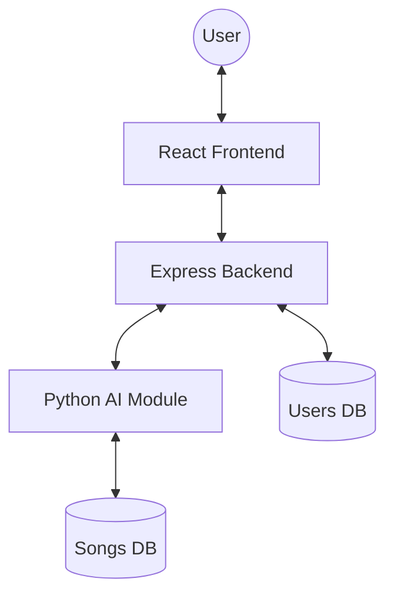
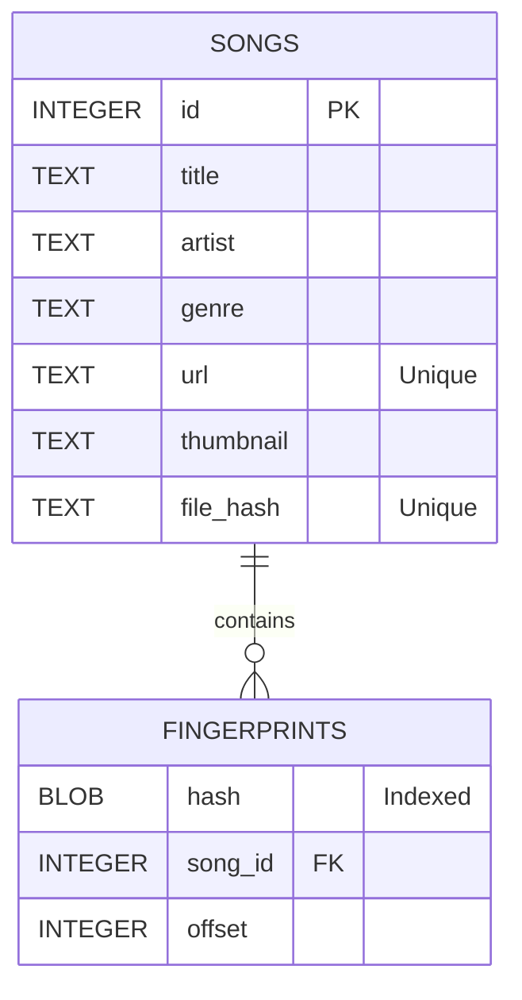
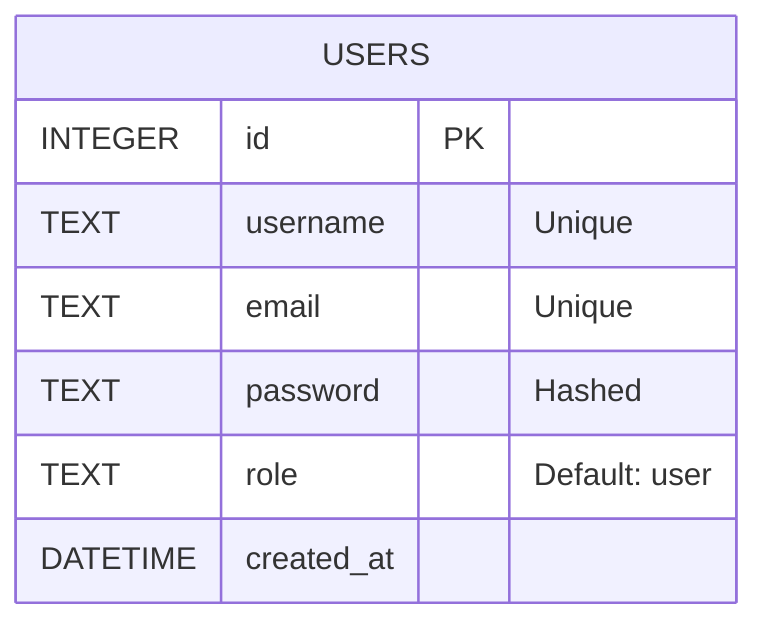

# System Architecture & Database Schema

## 1. System Overview
Viltrumite follows a modular architecture separating the user interface, backend orchestration, and AI-powered audio processing.

## 2. Database Schema (ERD)

### 2.1 Songs Database (`songs.db`)
Responsible for storing track metadata and acoustic fingerprints.

### 2.2 Users Database (`users.db`)
Responsible for authentication and user profiles.

## 3. Core Workflows

### 3.1 Recognition Flow
1. **Frontend**: Captures audio -> `POST /api/recognize` (as blob/file).
2. **Backend**: Saves file -> Calls `recognizer.py <file_path>`.
3. **AI Module**: 
    - Loads audio (Librosa).
    - Generates 2D peaks from Spectrogram.
    - Creates hashes (Delta-Time Hashing).
    - Queries `songs.db` for hash matches.
    - Aligns matches and calculates confidence.
4. **Backend**: Returns match result to Frontend.

### 3.2 Indexing Flow
1. **Frontend**: Submit URL -> `POST /api/songs/manual`.
2. **Backend**: Calls `user_adder.py <url>`.
3. **AI Module**: 
    - Downloads audio (yt-dlp).
    - Checks for duplicates (Title/Audio).
    - Fingerprints and stores in `songs.db`.
