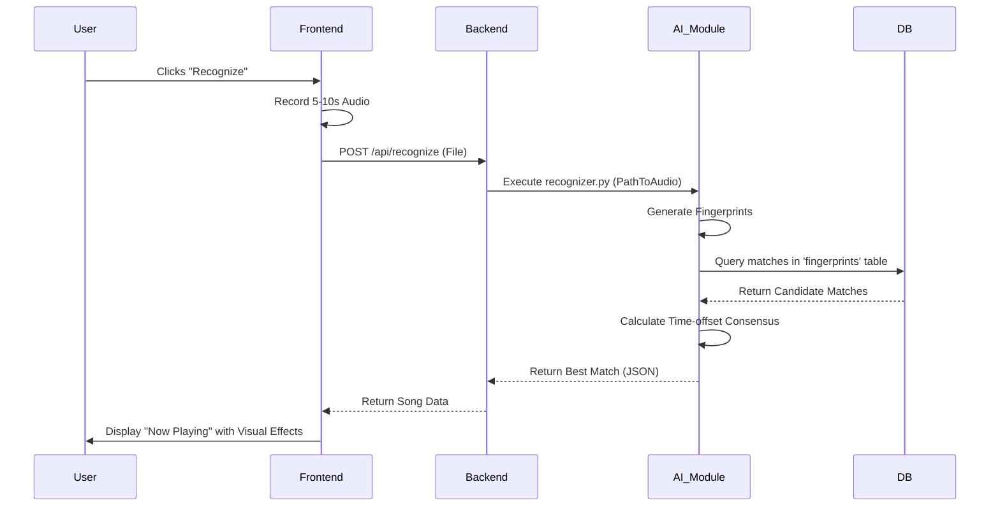

# Viltrumite: High-Fidelity Music Recognition 🎵

Viltrumite is a next-generation music discovery engine designed to identify tracks with extreme precision. Inspired by the logic of Shazam, it leverages advanced acoustic fingerprinting to translate audio waveforms into unique mathematical "fingerprints," specifically tailored for high-fidelity detection and regional music preservation.

---

## 🌐 Live Deployments

- **Frontend (UI)**: [https://viltrumite-music-detector.vercel.app/](https://viltrumite-music-detector.vercel.app/)
- **Backend (API)**: [https://viltrumite-music-detector.onrender.com](https://viltrumite-music-detector.onrender.com)

---

## 🧩 System Architecture

Viltrumite is built on a modular architecture that separates concerns between user interface, business logic, and heavy-duty audio processing.

### 🧠 AI & Audio Module (The Core)
The heart of Viltrumite is its Python-based recognition engine. It doesn't just "listen"; it mathematically maps audio.

- **Acoustic Fingerprinting**: Uses a customized version of the Shazam algorithm.
  1. **Spectrogram Generation**: Audio is converted into a 2D Time-Frequency representation using Short-Time Fourier Transform (STFT).
  2. **Peak Extraction**: High-intensity points (peaks) are identified in the spectrogram, creating a "constellation map."
  3. **Combinatorial Hashing**: Pairs of peaks are linked together to form unique hashes. Each hash contains two frequencies and the time delta between them (`f1|f2|delta_t`).
  4. **Alignment Logic**: When a recording is matched against the database, we don't just look for hashes; we look for a consistent **time offset** (consensus) across all matched hashes to ensure temporal accuracy.
- **Tools**: `librosa` for audio math, `scipy` for peak finding, and `numpy` for high-speed array processing.

### ⚙️ Backend (The Orchestra)
The Node.js (Express) backend serves as the orchestrator between the user and the AI core.

- **Request Handling**: Receives multipart audio uploads from the frontend.
- **Service Layer**: Manages asynchronous communication with the Python AI module using `child_process`.
- **Database**: Dual-database strategy:
  - `songs.db`: Stores song metadata and the high-volume `fingerprints` table (millions of entries).
  - `users.db`: Stores encrypted user credentials and profiles.
- **Auto-Discovery**: Features specialized scripts (`youtube_indexer.py`) that can scrape, download, and index songs directly from YouTube into the fingerprint vault.

### 🎨 Frontend (The Vision)
A high-performance React application designed for speed and visual "wow."

- **State Management**: Uses modern React hooks for real-time recognition status and library filtering.
- **Audio Processing**: Leverages the Web Audio API to capture microphone input directly in the browser and prepare it for server-side analysis.
- **Visuals**: Powered by `Framer Motion` and `GSAP` to create fluid transitions, micro-animations, and a premium "glassmorphism" aesthetic.

---

## 🛠️ Project Structure

```text
Viltrumite/
├── AI-Module/          # Python Core (Fingerprinting & Recognition)
│   ├── Core/           # Fingerprinter, Database Handlers
│   ├── Inference/      # Recognition Logic, Fallback Systems
│   └── Preprocessing/  # Audio loading and Spectrogram generation
├── Backend/            # Express API & Orchestration
│   ├── src/routes/     # Auth, Songs, and Recognition endpoints
│   └── src/services/   # Python bridge and storage services
├── Frontend/           # React 19 + Vite UI
│   ├── src/components/ # Reusable UI atoms (AudioRecorder, Toasts)
│   └── src/pages/      # Feature containers (Home, Library, Auth)
├── Databases/          # SQLite3 storage (songs.db, users.db)
└── Documentation/      # SRS and System Design documents
```

---

## 🔄 The Recognition Flow



---

## 📦 Getting Started

### **Option 1: Quick Start (Docker)**
The easiest way to run Viltrumite is using Docker Compose.

1.  **Generate a Secret**:
    ```bash
    node -e "console.log(require('crypto').randomBytes(64).toString('hex'))"
    ```
2.  **Setup Environment**:
    ```bash
    cp .env.example .env
    # Edit .env and paste your generated JWT_SECRET
    ```
3.  **Launch**:
    ```bash
    docker-compose up --build
    ```

### **Option 2: Local Development**
Refer to the individual `package.json` files for local scripts:
- **Backend**: `cd Backend && npm install && npm run dev`
- **Frontend**: `cd Frontend && npm install && npm run dev`

---

## 📂 Project Documentation

Detailed project architecture and requirements are available in the [Documentation](file:///home/uzairmajeed/BS_SE/SideProjects/Viltrumite/Documentation) folder:
- [SRS.md](file:///home/uzairmajeed/BS_SE/SideProjects/Viltrumite/Documentation/SRS.md) - Software Requirements Specification.
- [Architecture.md](file:///home/uzairmajeed/BS_SE/SideProjects/Viltrumite/Documentation/Architecture.md) - System design and Database ERD.

---

## 📖 The Story

Created by **Uzair Majeed**, a BS Software Engineering student, Viltrumite was born out of a fascination with how machines perceive sound. More than just a tool, it's a testament to what's possible when curiosity meets code. Join us in expanding this musical universe.

---

## 🛡️ License
Fun Project.